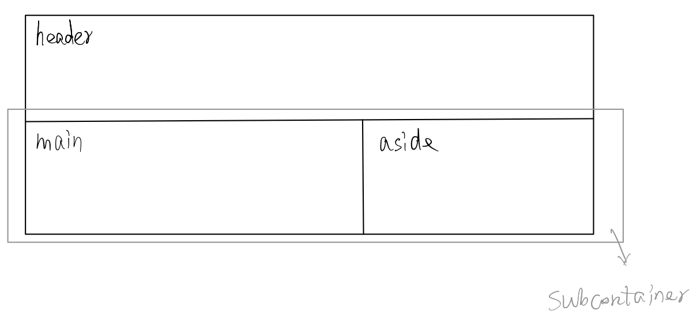

# Frontend Mentor - Single price grid component solution

This is a solution to the [Single price grid component challenge on Frontend Mentor](https://www.frontendmentor.io/challenges/single-price-grid-component-5ce41129d0ff452fec5abbbc).

## My process

### Built with

- Semantic HTML5 markup
- CSS custom properties
- Flexbox

利用 flex 实现等高的两栏布局


```css
.subcontainer {
  display: flex;
}
main {
  width: 60%;
}
aside {
  width: 40%;
}
```

[codepen](https://codepen.io/effycoco/pen/GRveaQV)
